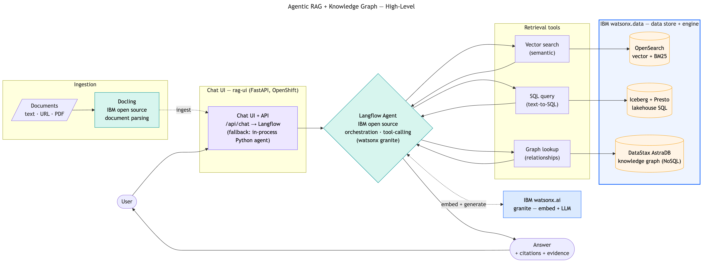
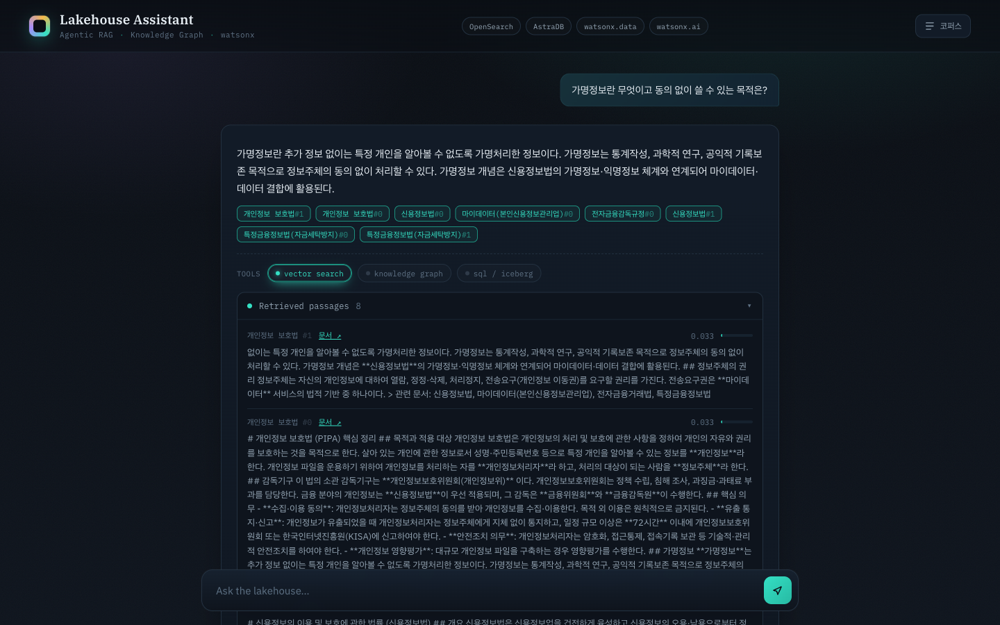
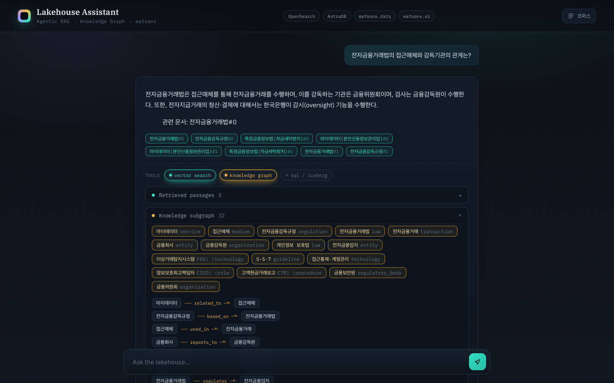
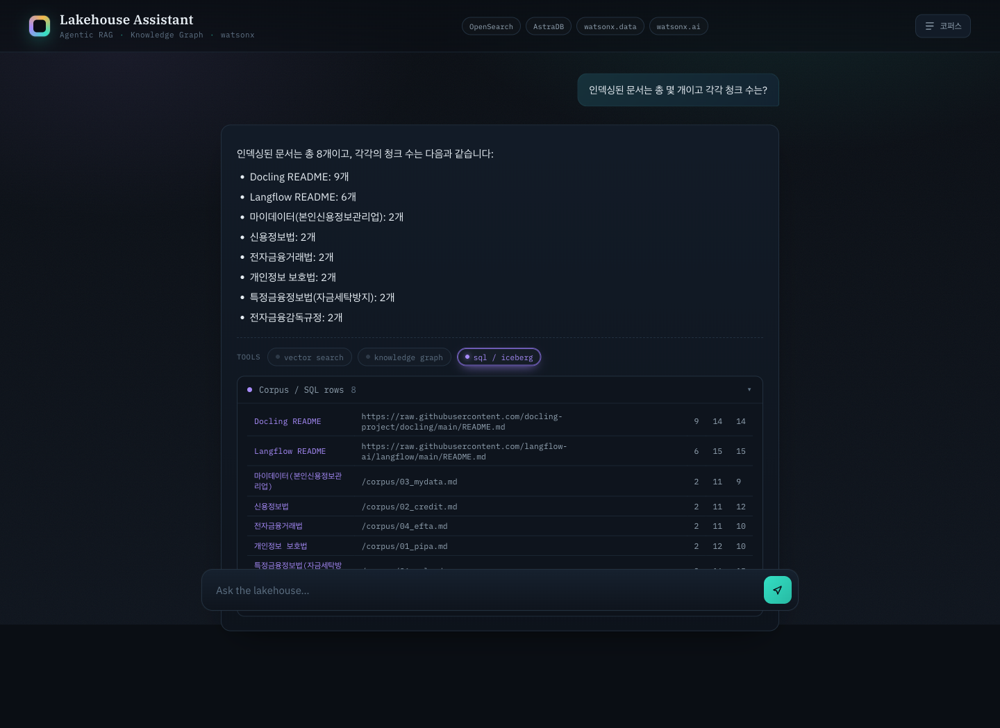
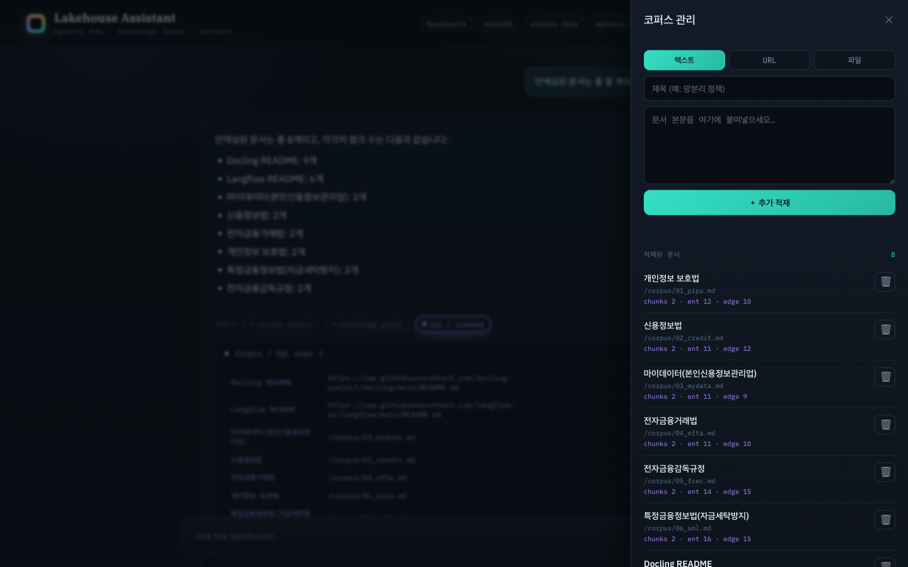
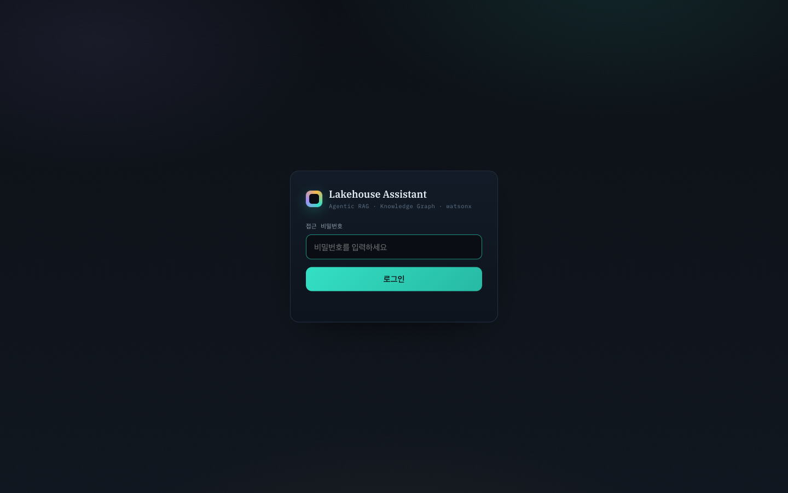

<!--
발표 자료 (Marp 호환). PDF/PPTX 변환:
  npx @marp-team/marp-cli docs/presentation.md -o docs/presentation.pdf
  npx @marp-team/marp-cli docs/presentation.md --pptx -o docs/presentation.pptx
각 슬라이드 끝의 "발표 노트:" 블록은 말하기 대본입니다.
-->

<!-- 로고: IBM 8-bar 로고를 docs/img/ibm-logo.png 로 추가한 뒤 아래 주석을 해제하세요 (공개 repo .md엔 넣지 말고 발표 파일에만 권장)

-->

# AI-Ready Context
## watsonx 위에 올린 설명가능한 Agentic RAG + Knowledge Graph

질문마다 **벡터 · 그래프 · SQL** 도구로 자동 라우팅하고
**답의 근거를 그대로 보여주는** 데모

<br>

**Kiyeon Jeon** &nbsp;·&nbsp; AI Engineer, **IBM Client Engineering** Korea
IBM TechXchange Korea 워크숍

> 발표 노트: "안녕하세요, IBM Client Engineering Korea의 AI Engineer 전기연입니다. 오늘 보여드릴 건 RAG를 한 단계 더 끌어올린 형태입니다. 질문에 따라 적합한 검색 도구를 에이전트가 스스로 고르고, 그 근거를 화면에 펼쳐 보여줍니다. 전부 watsonx 스택과 OpenShift 위에 올렸습니다."

---

# 목차

1. **배경** — 왜 Agentic RAG + Knowledge Graph인가
2. **아키텍처 & 데이터** — 스토어 구성 · 동작 방식 · 문서 적재 · 데모 코퍼스
3. **데모** — ① 3경로 라우팅(vector/graph/sql) · ② No-code 즉석 적재 · ③ 설명가능성
4. **고도화** — 각 도구를 한 단계 더 (text-to-SQL · KG · 혼합문서 · Langflow)
5. **심화** — KG를 그래프DB가 아닌 NoSQL(AstraDB)에 담은 법
6. **운영** — 검색·KG 품질 개선 · 배포 · 보안 · 한계
7. **정리 & Q&A**

> 발표 노트: "순서는 이렇습니다. 배경을 짧게 말씀드리고, 아키텍처와 데이터 구성을 본 뒤, 라이브 데모로 세 경로와 즉석 적재를 보여드립니다. 그다음 이번에 각 도구를 어떻게 더 깊게 만들었는지 고도화를 다루고, '왜 그래프DB가 아니냐'를 심화로, 운영 관점으로 마무리합니다."

---

# 왜 이걸 만들었나

- **RAG의 한계** — 벡터 검색 하나로는 못 푸는 질문이 많다
  - "총 몇 개 문서가 있나?" → 검색이 아니라 **집계(SQL)**
  - "A 법과 B 기관의 관계는?" → 의미 유사도가 아니라 **관계(그래프)**
- **신뢰 문제** — LLM 답이 맞는지 어떻게 믿나? → **근거(grounding)를 보여줘야 한다**
- **운영 현실** — 폐쇄망/규제 산업은 SaaS LLM을 그냥 못 쓴다 → **watsonx로 거버넌스**

→ **"질문에 맞는 도구를 고르고, 근거를 보여주는"** 에이전틱 RAG

> 발표 노트: "현장에서 RAG PoC를 하면 꼭 막히는 지점이 있습니다. 집계형 질문, 관계형 질문, 그리고 '이 답 믿어도 되냐'는 질문이죠. 이 세 가지를 정면으로 다룬 게 이 데모입니다."

---

# 무엇을 보여주나 (3가지 포인트)

1. **에이전트 라우팅** — Langflow의 watsonx granite 에이전트가 `vector / graph / sql` 도구를 tool-calling으로 선택
   → 어떤 도구를 썼는지 **tool-trace 배지**로 표시

2. **설명가능성(Explainability)** — 답변마다 인용 + 근거 패널
   → 검색된 청크 · KG 서브그래프 · SQL 결과를 **펼쳐서** 확인

3. **No-code 즉석 적재** — UI에서 문서를 텍스트/URL/PDF로 추가
   → **답이 즉시 바뀌고**, 삭제하면 원복
   → "grounding 있으면 정확, 없으면 환각"을 **클릭만으로** 시연

> 발표 노트: "딱 세 가지만 기억하시면 됩니다. 라우팅, 설명가능성, 그리고 즉석 적재. 마지막 세 번째가 오늘의 하이라이트입니다."

---

# 아키텍처 (High-Level)



> 발표 노트: "전체 그림입니다. 사용자 질문이 챗 UI를 거쳐 Langflow 에이전트로 들어가면, 세 검색 도구 중 필요한 걸 골라 watsonx.data를 읽고, watsonx.ai로 답을 생성해 근거와 함께 돌려줍니다. 상세 그림은 docs/architecture.pdf에 있습니다."

---

# 구성요소 (스택)

| 역할 | 구성요소 |
|---|---|
| Chat UI | `rag-ui` — FastAPI (OpenShift) · tool-trace·근거 패널 |
| 오케스트레이션 | **Langflow** 에이전트 (IBM open source, tool-calling) · 파이썬 폴백 |
| 벡터 검색 | **OpenSearch** (IBM watsonx.data) — kNN + BM25 하이브리드 |
| 지식그래프 | **DataStax AstraDB** (IBM watsonx.data) — 엔티티(+emb)/엣지 |
| text-to-SQL | **IBM watsonx.data** Iceberg + Presto — AML 데이터셋 |
| 임베딩 + LLM | **IBM watsonx.ai** granite |
| 문서 파싱 | **Docling** (IBM open source) |

> 발표 노트: "구성요소입니다. 오케스트레이션은 IBM 오픈소스 Langflow, 저장·질의는 watsonx.data(OpenSearch·Iceberg/Presto·DataStax AstraDB), 임베딩과 LLM은 watsonx.ai granite, 문서 파싱도 오픈소스 Docling — 전부 IBM 스택입니다."

---

# 데이터 스토어 — 한 질문, 세 가지 검색

<!-- 제품 로고: docs/img/ 에 로고 파일을 두면 아래 한 줄로 표 위에 배치됩니다 (예시 — 파일 추가 후 주석 해제)
 &nbsp;  &nbsp;  &nbsp; 
-->

| 스토어 | 무엇을 담나 | 어떤 질문에 강한가 |
|---|---|---|
| **OpenSearch** | 청크 + 임베딩(768d) + 원문 텍스트 | "가명정보란 무엇인가" (의미 검색) |
| **AstraDB (KG)** | 엔티티(임베딩) · 관계(엣지) | "접근매체와 감독기관의 관계" (관계) |
| **Iceberg / Presto** | AML 비즈니스 데이터셋 | "위험등급 high 고객의 거래 총액" (text-to-SQL) |

- 핵심: **같은 문서를 세 가지 형태로** 저장해 두고, 질문에 맞춰 골라 읽는다
- 세 스토어 모두 **IBM watsonx.data** 패밀리 (OpenSearch · Iceberg/Presto · DataStax AstraDB)
- OpenSearch는 벡터(의미) + BM25(정확 매칭)를 **RRF로 융합** → 약어·법령명에 강함

> 발표 노트: "같은 문서를 세 가지 모양으로 저장해 둡니다. 줄글, 관계망, 표. 질문이 어떤 모양을 원하는지에 따라 에이전트가 적절한 걸 꺼내 씁니다."

---

# 동작 방식 — 질문이 들어오면

```
질문
 → [라우터]  granite가 도구 선택  {vector, graph, sql}  (+관계형 키워드 백스톱)
 → vector :  OpenSearch 하이브리드 (kNN + BM25, RRF 융합, k=8)
   graph  :  AstraDB KG — 엔티티 임베딩 시드 → 1홉 이웃 조회 → 별칭 병합
   sql    :  text-to-SQL — granite가 Presto SELECT 생성 → 가드 → 실행 (AML 데이터)
 → [합성]   granite가 컨텍스트로 답변 생성 + 인용
 → UI :     답변 + tool-trace 배지 + 근거 패널 (생성 SQL 포함)
```

- 챗 UI(`/api/chat`)는 오케스트레이션을 **Langflow 에이전트에 위임**(watsonx granite, tool-calling)
  — 오류 시 **in-process 파이썬 에이전트로 폴백**(무대 안전망)
- 라우팅·검색·합성·임베딩은 전부 **watsonx.ai granite**, 답변 언어는 질문 언어를 따름(한글→한글)

> 발표 노트: "내부 흐름입니다. 챗 UI가 질문을 Langflow 에이전트에 넘기면, 에이전트가 도구를 골라 호출하고 합성합니다. 전부 watsonx granite로 처리하고, SQL은 자연어를 SQL로 바꿔 실행합니다. 혹시 Langflow가 실패하면 같은 일을 하는 파이썬 에이전트로 자동 폴백합니다."

---

# 문서 적재 — 한 번에 4개 저장소

```
ingest_source(문서)   doc_id = sha1(source)
  ├─ OpenSearch          : 청크 + granite 임베딩(768d)   ← vector
  ├─ AstraDB kg          : granite 추출 엔티티(+emb)/엣지  ← graph
  ├─ AstraDB doc_registry: 제목·소스·해시·카운트          ← 추적/증분
  └─ Iceberg corpus      : 문서 인벤토리 1행              ← sql
```

- **멱등 upsert** (doc_id 기준) + **content-hash 스킵** → 재적재해도 중복 없음
- **CronJob `rag-reindex`** (30분): 등록된 소스 재적재, 바뀐 것만 재처리
- 문서 파싱은 **docling-serve** (텍스트 / URL / PDF·DOCX → markdown)

> 발표 노트: "문서 하나를 넣으면 같은 ID로 네 군데에 동시에 들어갑니다. 벡터, 그래프, 추적 레지스트리, SQL 인벤토리. 해시 기반이라 같은 문서를 또 넣어도 중복되지 않습니다."

---

# 데모 코퍼스 — 한글 금융·컴플라이언스

한글 금융 법령 + 영문 README — **md · PDF · URL 세 입력 경로가 모두 섞인** 혼합 코퍼스

- **md (4)** — 개인정보 보호법 · 마이데이터 · 전자금융거래법 · 전자금융감독규정
- **PDF (2)** — 신용정보법 · 특정금융정보법 *(docling 변환 적재)*
- **URL (2)** — Docling README · Langflow README *(docling fetch)*

<br>

- **왜 금융 법령?** 법령 간 **교차참조가 많아** 지식그래프가 "의미를 갖는" 도메인
- md/PDF/URL 혼합 → **문서 처리 다양성** + 한글/영문 다국어 동시 시연
- 별도 **AML 비즈니스 데이터셋**(`iceberg_data.aml`)으로 text-to-SQL 시연

> 발표 노트: "코퍼스를 일부러 한국 금융 법령으로 골랐습니다. 법끼리 서로를 인용하는 관계가 많아서, 지식그래프가 진짜 쓸모 있는 도메인이거든요. 영문 문서도 섞어서 다국어 처리도 같이 보여줍니다."

---

# 데모 1 — 세 가지 검색 경로

| 경로 | 예시 질문 | 보여줄 것 |
|---|---|---|
| **vector** | "가명정보란 무엇이고 동의 없이 쓸 수 있는 목적은?" | 인용칩 + 검색 청크(유사도 바) |
| **graph** | "접근매체와 감독기관의 관계를 지식그래프로 보여줘" | 엔티티 칩 + 엣지 트리플 |
| **sql** | "위험등급 high 고객의 플래그 거래 총액을 상대국가별로?" | 생성 SQL 코드블록 + 결과 표 |
| **hybrid** | "자금세탁 의심거래는 어디 보고하고, VASP 의무는?" | vector+graph 배지 동시 점등 |

→ 각 답변에서 **tool-trace 배지**와 **근거 패널**을 펼쳐 보여준다

> 발표 노트: "첫 데모는 세 경로를 하나씩 보여줍니다. 질문을 바꿀 때마다 위쪽 배지가 어떤 도구를 썼는지 알려주고, 패널을 열면 실제 근거가 나옵니다."

---

# 데모 1a — vector 경로



> 발표 노트: "벡터 경로입니다. '가명정보' 질문에 의미 검색으로 답하고, vector search 배지가 켜졌습니다. 아래 Retrieved passages를 펼치면 검색된 청크와 유사도가 그대로 보입니다."

---

# 데모 1b — graph 경로



> 발표 노트: "관계형 질문은 그래프로 갑니다. 답변과 함께 엔티티 칩과 엣지 트리플로 서브그래프를 펼쳐 보여줍니다. 전자금융거래법-감독기관-금융회사 관계가 그래프로 드러납니다."

---

# 데모 1c — sql 경로 (text-to-SQL)



<!-- 화면은 초기 corpus-인벤토리 예시. 고도화 후 SQL 경로는 AML 데이터셋 text-to-SQL(생성 SQL 노출) — '고도화 ★' 슬라이드 참고 -->

> 발표 노트: "집계형 질문은 SQL로 갑니다. 고도화 전엔 문서 인벤토리 집계였고(이 화면), 지금은 AML 비즈니스 데이터셋에 자연어로 묻는 text-to-SQL입니다. granite가 SQL을 만들고 실행해, 생성된 SQL과 결과 행을 함께 보여줍니다. 검색이 아니라 데이터 질의로 푸는 질문이죠. (상세는 고도화 슬라이드)"

---

# 데모 2 ★ — No-code 즉석 적재 (하이라이트)

RAG의 본질을 **UI 클릭만으로** 시연

1. **적재 전 질문** — "클라우드 보안인증(CSAP)는 어느 기관이 평가하나?"
   → ❌ **환각** (코퍼스에 없어 엉뚱한 답/가짜 인용)
2. **⚙ 코퍼스 드로어** → 텍스트 탭 → 제목+본문 붙여넣기 → **추가 적재**
   → "적재 완료" 토스트, 목록 8 → 9
3. **같은 질문 재질의** → ✅ **정확** + 새 문서 인용
4. **🗑 삭제** → 같은 질문 → 다시 **환각으로 원복**

입력 3종: **텍스트**(주력) · **URL**(docling fetch) · **파일**(PDF/DOCX)

> 발표 노트: "이게 핵심입니다. 코퍼스에 없는 걸 물으면 모델이 지어냅니다. 그 자리에서 문서를 붙여넣고 다시 물으면 정확히 답하고 인용까지 합니다. 지우면 다시 환각으로 돌아갑니다. '근거가 있으면 정확, 없으면 환각'을 30초 만에 보여주는 거죠."

---

# 데모 2 — 코퍼스 관리 드로어



> 발표 노트: "우측 드로어입니다. 텍스트/URL/파일 탭으로 추가하고, 아래 목록에서 문서별 청크·엔티티·엣지 수를 보며 휴지통으로 삭제합니다. 코드 한 줄 없이 코퍼스를 바꾸는 거죠."

---

# 설명가능성 — 근거를 어떻게 보여주나

- **tool-trace 배지** — 이 답에 vector / graph / sql 중 무엇을 썼는지
- **인용 칩** — 답변 속 주장 ↔ 출처 문서 연결
- **근거 패널** (펼치기)
  - Retrieved passages — 청크별 유사도 바
  - Knowledge subgraph — 엔티티 + 엣지 트리플
  - Corpus / SQL rows — Iceberg 테이블
- **출처 링크** — URL 문서는 원문, 직접작성 md는 `/corpus/*.md` 서빙으로 열림

> 발표 노트: "신뢰의 핵심은 '왜 이렇게 답했는지'를 보여주는 겁니다. 배지로 도구를 보여주고, 패널로 실제 근거를 보여주고, 출처는 클릭하면 원문이 열립니다. 블랙박스가 아닙니다."

---

# 고도화 — 각 도구를 한 단계 더

<style scoped>section{font-size:22px} table{font-size:.82em} li{margin:.12em 0}</style>

"모양만 에이전틱"에서 **각 도구에 실제 깊이**를 — 설명가능성 UI와 무대 안정성은 그대로

| 도구 | Before (얕음) | After (이번 고도화) |
|---|---|---|
| **SQL** | corpus 메타데이터 고정 쿼리 | **text-to-SQL** — AML 데이터셋에 granite가 SELECT 생성·실행 (SELECT-only 가드 + self-correction), 생성 SQL 노출 |
| **KG** | 전체 로드 + 문자열 매칭 | **엔티티 임베딩 시드 + 엔티티 해소 + 타입 온톨로지** → 1홉 서브그래프 |
| **문서** | md 6종 | **md + PDF + URL 혼합** (docling 변환) |
| **오케스트레이션** | 파이썬 단일패스 라우터 | **Langflow 에이전트가 메인** (tool-calling, 파이썬은 폴백) |

- 공통: 라우터에 **관계형 키워드 백스톱** (granite의 graph 과소선택 보완)
- 원칙: 데모는 명료·안정 / **프로덕션 경로는 README "데모↔프로덕션" 표로 정직하게**

> 발표 노트: "처음 버전은 에이전틱의 '모양'은 있었지만 각 도구가 얕았습니다. 이번에 네 축을 실제 깊이로 끌어올렸습니다. SQL은 진짜 text-to-SQL로, 그래프는 임베딩 시드와 엔티티 해소로, 문서는 PDF·URL 혼합으로, 오케스트레이션은 Langflow 비주얼 에이전트를 추가했습니다. 못 가는 부분은 README에 데모-프로덕션 대조표로 정직하게 적었습니다."

---

# 고도화 ★ — text-to-SQL (watsonx.data)

<style scoped>section{font-size:23px} pre{font-size:.8em;line-height:1.32} li{margin:.14em 0}</style>

corpus 인벤토리 고정쿼리 → **실제 비즈니스 데이터에 자연어 질의**

- **데이터셋**: `iceberg_data.aml` (AML/금융 테마) — customers · accounts · transactions · str_reports
- **파이프라인**:
```
질문 → granite가 Presto SELECT 생성 (스키마카드 + few-shot)
     → 가드 (SELECT-only · 자동 LIMIT · DDL 차단)
     → 실행, 에러 시 self-correction 1회
     → 결과 + 생성 SQL 을 패널에 노출
```
- 예: *"위험등급 high 고객의 플래그 거래 총액을 상대국가별로?"* → 3-테이블 조인 SQL 자동 생성·실행
- 프로덕션 경로: 시맨틱 레이어/dbt · 행수준 보안 · 쿼리 검증

> 발표 노트: "SQL 경로가 핵심 업그레이드입니다. 예전엔 '문서 몇 개냐' 같은 메타데이터 집계뿐이었는데, 이제 거래·고객·의심거래보고 같은 실제 비즈니스 테이블에 자연어로 묻습니다. granite가 SQL을 만들고, 읽기전용 가드를 통과시킨 뒤 실행하고, 실패하면 에러를 보고 한 번 고쳐 씁니다. 생성된 SQL도 화면에 그대로 보여줍니다."

---

# 고도화 — Langflow로 오케스트레이션을 눈으로

<style scoped>section{font-size:23px} pre{font-size:.82em;line-height:1.3} li{margin:.14em 0}</style>

watsonx granite **Agent가 RAG 도구를 스스로 골라 호출**하는 비주얼 플로우 — **챗 UI의 메인 오케스트레이터**(파이썬 에이전트는 폴백)

```
ChatInput ─► Agent (IBM watsonx.ai) ─► ChatOutput
                ▲ tools
   search_documents(vector) · lookup_relationships(graph) · query_business_data(SQL)
```

- rag-ui가 도구를 **HTTP 엔드포인트**로 노출 (`/api/tool/{vector,graph,sql}`, 토큰 게이트)
- 챗 UI `/api/chat` → Langflow 실행 → 응답의 tool 출력으로 **근거 패널(청크·KG·SQL) 그대로 복원**
- 검증: *"위험등급 high 고객 수?"* → `query_business_data` → **"7명"** / 관계 질문 → KG 16엣지
- **대화별 session_id**(브라우저 uuid)로 **멀티턴** 후속 질문 지원 + 사용자 격리 · "새 대화" 버튼으로 리셋 · Langflow 실패 시 파이썬 폴백
- 플로우 JSON·재생성 스크립트: `integrations/genai/flows/`

> 발표 노트: "챗 UI가 질문을 Langflow 에이전트에 넘기고, 에이전트가 watsonx granite로 도구를 골라 호출합니다. Langflow 실행 응답에서 각 도구의 출력을 꺼내 근거 패널을 그대로 복원하니, 설명가능성 UI는 똑같이 유지됩니다. 대화별 세션 ID로 멀티턴 후속 질문을 기억하고(사용자별로 격리), '새 대화' 버튼으로 리셋합니다. 혹시 Langflow가 실패하면 파이썬 에이전트로 폴백합니다."

---

# 심화 ① — KG를 NoSQL(AstraDB)에 담은 스키마

<style scoped>section{font-size:24px} pre{font-size:.78em;line-height:1.32} li{margin:.15em 0}</style>

**왜 그래프DB가 아니라 NoSQL?** 코퍼스가 작고(8문서 · ~100노드/108엣지), 질의는 "엔티티 주변 **1홉 서브그래프**"뿐 → 멀티홉 순회 엔진 불필요. **엔티티 임베딩으로 시드를 찾아 1홉 이웃만 읽으면** 충분.

**단일 컬렉션 `kg` — `kind` 필드로 노드/엣지 구분** (AstraDB Data API JSON 문서)

```json
{ "_id":"<doc_id>:e:3", "kind":"entity", "doc_id":"…", "name":"마이데이터",
  "type":"service_provider", "norm":"마이데이터", "emb":[…768d…] }

{ "_id":"<doc_id>:r:5", "kind":"edge", "doc_id":"…",
  "src":"마이데이터", "rel":"based_on", "dst":"신용정보법",
  "src_norm":"마이데이터", "dst_norm":"신용정보법" }   // 정규화 트리플
```

- `_id` = **doc_id 스코프** → 문서별 delete→insert로 **멱등 재적재** · `emb` = 768-d 임베딩(시드·해소용)
- `*_norm` = 정규화 키(별칭 병합) · `rel` = **통제 어휘 14종**, `type` = **온톨로지 11종**(snake_case 정규화)

> 발표 노트: "자주 받는 질문이죠 — 왜 그래프DB가 아니냐. 답은 '필요 없어서'입니다. 엣지를 평범한 JSON 문서로 평면 저장합니다. 한 컬렉션에 kind로 노드와 엣지를 같이 두고, 이름은 정규화 키를 미리 박아둡니다."

---

# 심화 ② — KG 적재·질의 동작

<style scoped>section{font-size:24px} pre{font-size:.76em;line-height:1.3} li{margin:.15em 0}</style>

**적재 (write)** — 문서 1건 → 같은 doc_id로 삭제 후 재삽입
```
granite가 {entities(type), edges} 추출  (타입 온톨로지 = 통제 어휘)
  → 엔티티 임베딩(emb) + 엔티티 해소(norm + 코사인 ≥0.90 병합)
  → astra_delete_all(doc_id)  →  insertMany   # 멱등
```

**질의 `tool_graph` (read)** — 벡터 시드 + 1홉 이웃 조회
```
질문 임베딩 → 엔티티 emb 와 코사인 → 의미적 시드 엔티티 선정
  → 1홉 엣지 조회  find({kind:edge, $or:[src_norm∈S, dst_norm∈S]})
  → 점수 = 질문 언급(+2) + 시드(+1) → *_norm 병합 · 자기루프 제거 → 칩 + 트리플
```

- **엔티티 해소**: 정규화 키 + **임베딩 코사인**으로 별칭/표기 변형 병합 (그래프엔진 불필요)
- ⚠️ 이 AstraDB는 서버사이드 **벡터 ANN 미지원**(SAI 'aa') → KG가 작아 **코사인 앱-사이드 계산**
- **트레이드오프**: 1홉 한정(멀티홉 순회 X). 스케일·트래버설은 → CQL 파티션 / 그래프DB

> 발표 노트: "질의는 순회가 아니라 '의미로 시드를 찾고 이웃만 읽기'입니다. 질문 임베딩을 엔티티 임베딩과 코사인으로 비교해 의미적으로 가까운 엔티티를 시드로 잡고, 그 1홉 이웃 엣지만 가져옵니다. 엔티티 해소도 정규화 키에 임베딩 유사도를 더해 별칭을 합칩니다. 이 AstraDB는 서버 벡터 검색을 못 해서 코사인은 앱에서 계산합니다 — KG가 작아 충분하고, 커지면 벡터 스토어나 그래프DB로 갑니다."

---

# 품질 개선 — 적용 완료

- **하이브리드 검색** — 벡터(의미) + BM25(정확매칭) **RRF 융합**
  → 약어·법령명(STR · VASP · CISO)에 강함
- **cjk 분석기** — 한글을 bigram 토큰화 → 한글 BM25 recall 대폭 개선
  (nori는 operator 관리 클러스터라 설치 불가 → 내장 cjk로 대체)
- **KG 정규화·해소** — 정규화 + **임베딩 코사인 엔티티 해소**(별칭 병합) ·
  **타입 온톨로지**(통제 어휘) · 관계 snake_case 강제 · 자기루프 제거
- **text-to-SQL 가드** — read-only(SELECT-only + LIMIT) · 실행 에러 self-correction 1회
- **라우터 백스톱** — 관계형 키워드로 graph 경로 보강 (granite 과소선택 보완)

> 발표 노트: "PoC를 실제로 쓸 만하게 만든 디테일들입니다. 한글 검색이 특히 까다로웠는데, 형태소 분석기를 못 깔아서 내장 cjk로 우회했고, 지식그래프는 같은 개념이 다른 노드로 쪼개지는 걸 정규화로 합쳤습니다."

---

# 배포 — 이미지 빌드 없이

- **내부 레지스트리 Removed** 환경 → 이미지 빌드 불가
- 해법: **ConfigMap + 런타임 pip-install** 패턴
  - 코드/정적파일을 ConfigMap으로 마운트 → `ubi9/python-312`가 기동 시 설치·실행
- 단일 컨테이너 FastAPI — 모든 자격증명은 백엔드(`rag-secrets`)에 보관
- 그래프 질의가 30s 초과 → 라우트 타임아웃 `120s` 설정

```bash
oc -n genai-apps create configmap rag-code --from-file=*.py --dry-run=client -o yaml | oc apply -f -
oc -n genai-apps rollout restart deploy/rag-ui   # 이미지 빌드 없음
```

> 발표 노트: "제약이 많은 환경이었습니다. 내부 레지스트리가 막혀 있어서 이미지를 못 만들었어요. 그래서 코드를 ConfigMap으로 올리고 컨테이너가 뜰 때 pip로 설치하는 패턴을 썼습니다. 제약 환경에서의 현실적인 배포 패턴입니다."

---

# 보안 — 공유 비밀번호 게이트



- 채팅 UI는 **공유 비밀번호 로그인**으로 보호 (서명된 세션 쿠키, HMAC)
- `rag-secrets`의 `APP_PASSWORD` 키로 설정 — **키 없으면 인증 없이 열림** (하위호환)
- 미인증: 페이지 → `/login` 리다이렉트, API → `401`
- ⚠️ 적재/삭제는 로그인 후 누구나 가능(데모 목적) → 운영엔 **사용자별 인증 + 트랜잭션 보강** 필요

> 발표 노트: "공개 데모라 공유 비밀번호 로그인만 붙였습니다. 적재·삭제는 로그인 후 누구나 가능 — 운영으로 가려면 사용자별 인증·트랜잭션이 더 필요합니다."

---

# 알아둘 한계 (데모 수용 범위)

- **무인증 쓰기** — 적재/삭제 공개. 운영 시 인증·outbox 트랜잭션 필요
- **라우터 비결정성** — granite가 graph 과소선택 → **키워드 백스톱으로 보강**(완전 결정적은 아님)
- **그래프 순회 아님** — 1홉 서브그래프 수준(멀티홉 X). AstraDB 비벡터 NoSQL → 벡터 시드는 앱-사이드 코사인
- **text-to-SQL 범위** — read-only 가드; 복잡 조인은 few-shot로 유도(완전 일반화 X)
- **docling-graph 미사용** — KG는 granite LLM 추출. docling-graph는 스캔PDF/복잡표용 옵션

> 발표 노트: "정직하게 한계도 말씀드립니다. 라우터가 가끔 틀리고, 그래프는 한 홉짜리 단순 서브그래프입니다. 멀티홉 경로 탐색이 필요하면 진짜 그래프 DB가 필요합니다. 데모 범위에서 수용한 트레이드오프들입니다."

---

# 핵심 메시지

- **Agentic RAG** = 검색 하나가 아니라, 질문에 **맞는 도구를 고르는** 것
- **Explainability** = 답뿐 아니라 **근거를 보여줘야** 신뢰가 생긴다
- **AI-Ready Context** = 같은 문서를 **벡터·그래프·SQL** 세 형태로 준비
- **watsonx + OpenShift** = 규제 산업에서도 **거버넌스 가능한** 스택

<br>

데모: `https://rag-ui-genai-apps.apps.<CLUSTER_DOMAIN>`
코드: `github.com/kiyeonjeon21/techxchange-ai-ready-context`

<!-- 마무리 로고: docs/img/ibm-logo.png 추가 후 주석 해제

-->

> 발표 노트: "정리하겠습니다. 에이전틱 RAG는 도구 선택이고, 설명가능성은 신뢰의 조건이고, 그러려면 데이터를 세 가지 형태로 미리 준비해 둬야 합니다. 그리고 이 모든 걸 watsonx와 OpenShift 위에서 거버넌스 가능한 형태로 했습니다. 감사합니다."

---

# Q&A / 부록 — 기술 노트

- watsonx.data Presto는 **PrestoDB** (`presto-python-client`, trino 아님)
- OpenSearch: faiss 없음 → **lucene kNN**, 한글 BM25는 **cjk 분석기**
- KG: granite 추출 + 임베딩(`emb`) 엔티티 해소 + 타입 온톨로지; 1홉은 `$or/$in` 서버 필터
- text-to-SQL: 스키마카드+few-shot, SELECT-only 가드, self-correction (`iceberg_data.aml`)
- 모델: granite (챗 엔진 라우팅/합성/text2sql) + granite-embedding-278m-multilingual (768d)
  · Langflow 플로우는 watsonx 컴포넌트 모델목록 제약으로 **granite-4-h-small** 사용
- Langflow: 챗 UI `/api/chat`의 **메인 오케스트레이터**(파이썬 폴백) → rag-ui `/api/tool/*`(토큰 게이트) tool-calling (`flows/agentic-rag.json`)
- 파싱: docling-serve `/v1/convert/source`(URL) · `/v1/convert/file`(multipart, PDF)

상세: [`docs/architecture.pdf`](architecture.pdf) · [`docs/wxdata-install-journey.md`](wxdata-install-journey.md) · [`NOTE.md`](../NOTE.md)

> 발표 노트: "질문 받겠습니다. 기술적으로 더 깊은 내용은 이 부록과 저장소의 NOTE.md, 구축 여정 문서에 정리해 뒀습니다."
